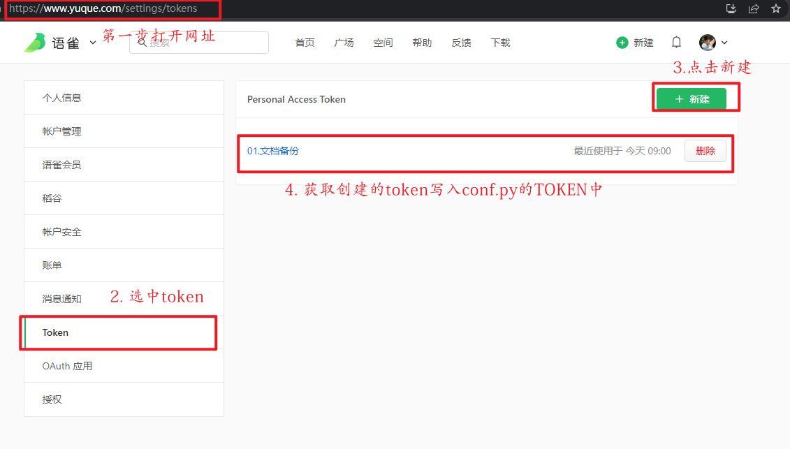
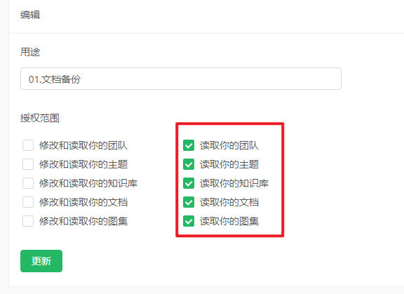
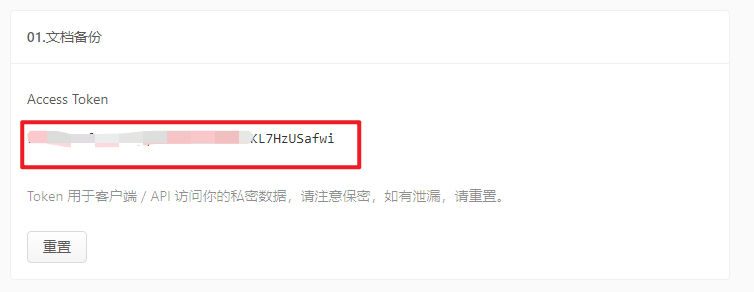
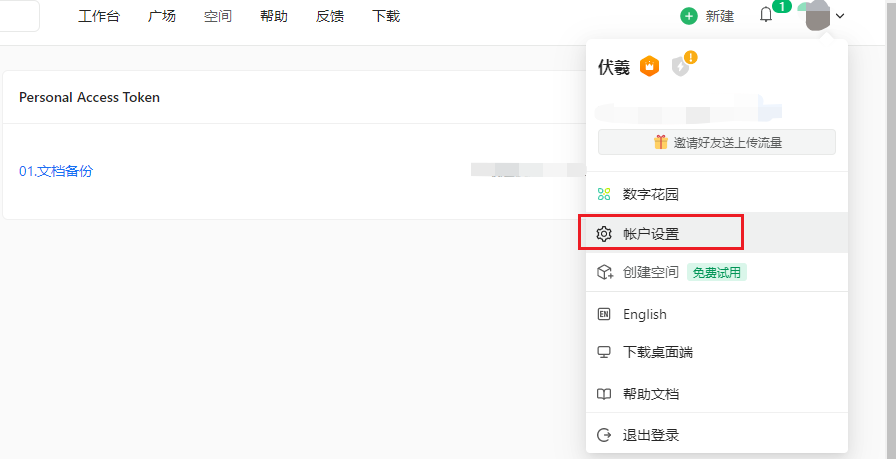

# 语雀备份

#### 介绍
用来备份语雀文档，保障资料安全.毕竟在人家服务器上，万一哪一天访问不了，就麻烦了，自己有一份备份心里妥妥的。

#### 软件架构
软件架构说明


#### 安装教程
1. 安装python解释器

#### 使用说明步骤
**第一步：获取token:登录语雀平台设置token**
1. 登录语雀平台：https://www.yuque.com/settings/tokens
2. 授权读取的权限即可


3. 获取生成的token，放在文件conf.py的TOKEN中
  

**第二步：获取路径：点开账号设置**
账号管理-》个人路径（去后最后几位，也即是你自定义的路径）

  

**第三步：拉取代码**  
4. 拉取代码  
```python
    安装模块    
    pip install requests
```
修改配置中的信息如图  
必填项：个人路径
必填项：token
非必填：备份路径
非必填：保存格式（建议html兼容性好）


5. 执行  
python main.py
6. 备份好的文档，您也可以上传到云盘再次保存，记得压缩加密哈  
#### 参与贡献

1.  Fork 本仓库
2.  新建 Feat_xxx 分支
3.  提交代码
4.  新建 Pull Request

